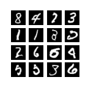

# DeepLearning-Collection  
This repository consists of codes of some different fields of Deep Learning; such as GANs, Series prediction, Style transfer, Deep Dream, Auto encoders and etc.  

## Demo  
### Deep Dream
> Layers' contribution to project their outputs of the [Inception V3](https://arxiv.org/abs/1512.00567) model on the input image.
- `"mixed2": 0.2`
- `"mixed3": 3.0`
- `"mixed4": 2.0`
- `"mixed5": 1.5`

Input image| Reconstructed image
:--------------:|:------------------:
 | 
### Style Transfer
>Style and content layers both have been chosen from [VGG19](https://arxiv.org/abs/1409.1556) model.  

-  `content layer: "block5_conv2"`
-  `style layers:{  
               "block1_conv1",
               "block2_conv1",
               "block3_conv1",
               "block4_conv1",
               "block5_conv1"`}

Content image| Style image| Output image
:--------------:|:--------------:|:--------------:
 | | 

### GAN  
- Deep Convolutional GAN on MNIST data set.

Epoch 500| Epoch 15000| Epoch 30000| Epoch 40000
:--------------:|:--------------:|:--------------:|:--------------:
 | | | 

- Auxiliary GAN on MNIST data set.
- 
Epoch 5000| Epoch 10000| Epoch 15000| Epoch 20000
:--------------:|:--------------:|:--------------:|:--------------:
 | | | 

### Auto Encoders
- Simple Auto Encoder on MNIST data set.
Input image| Decodes image

:--------------:|:------------------:
 | 

## Acknowledgement
All credits goes to [Pooya-Mohammadi-K](https://github.com/Pooya-Mohammadi-K). The codes have been implemented in his [Advanced Deep Learning](https://github.com/Practical-AI/AdvancedDeepLearning) class conducted in K.N Toosi University of technology, summer 2019. Persian videos of the class is available on [youtube](https://www.youtube.com/watch?v=AChPRCwZW4s&list=PL2g_5adpoaeL2bWnE5K-ctgjCn1HbmHGv).
